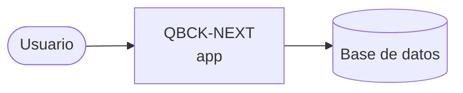

# Arquitectura

_Proyecto: **QBCK-NEXT** · Stack: **React Next.js App Router / TypeScript / Next.js / 14.0 / Node 20 LTS / Turborepo / Vitest**_

## Diagrama C4 — Context

## Dominio
# Domain

## Entidades principales

### Doc
Documento técnico (ADR, guía, onboarding, plan de carrera, capacitación).
- id, slug, title, category, content (Markdown), diagrams[], tags[], role_visibility
- Fuente de verdad: repo Git `quind-architecture-docs` — solo lectura en Backstage
- Invariante: un Doc sin slug válido no se indexa

### ADR
Subentidad de Doc. Campos adicionales: status (Proposed | Accepted | Deprecated), authors[], decision_date.

### OKR
- id, period (Q2-2026…), coe_id, objective, key_results[]
- Invariante: un OKR sin al menos un KR activo no puede marcarse como Activo
- Datos dinámicos: persisten en Postgres

### KeyResult
- id, okr_id, description, kpi, baseline, target, current_value, responsible, due_date, progress (0|25|50|75|100)

### User
- github_id, email, name, team (GitHub Team), role (Dev | TL | Coordinador | Gerencia)
- Rol derivado del GitHub Team — no se gestiona en Backstage

### CareerPath
- role_level (Dev Jr | Dev Sr | TL | Coordinador), milestones[], capacitaciones[]
- Solo lectura desde repo Git

## Reglas de negocio
- RBAC: Dev ve docs públicos; TL ve OKRs de su CoE; Coordinador ve todos los CoEs; Gerencia ve todo
- Un Doc solo es visible si el rol del usuario está en role_visibility
- OKR.progress = promedio de KeyResult.progress del período activo
- La fuente de verdad de docs es Git — nunca la base de datos

## Infraestructura
# Infrastructure

## Compute
- App: Next.js 15 App Router en Cloud Run (min=0, max=3 instancias)
- Kroki: imagen oficial self-hosted en Cloud Run (min=0) — render PlantUML/diagrams
- Cold start aceptable (~1-2s): uso interno

## Base de datos
- Postgres gestionado: Neon (free tier MVP) o Cloud SQL db-f1-micro
- ORM: Drizzle ORM (TypeScript-first, sin magic)
- Solo datos dinámicos: OKRs, KeyResults, audit log de accesos

## Autenticación
- Auth.js v5 (NextAuth) con GitHub OAuth
- Mapeo GitHub Team → Rol: Dev | TL | Coordinador | Gerencia
- Sesión en cookie cifrada (JWT). Sin base de datos de sesiones en MVP.

## Fuente de verdad de documentos
- Repo externo: `quind-architecture-docs` (markdown)
- Sync: git clone/pull en build time + revalidación vía webhook GitHub
- Sin base de datos para docs — filesystem en build

## Render de diagramas
- Mermaid: cliente (react-mermaid2 o mermaid.js directo)
- PlantUML / otros: proxy a Kroki self-hosted via Route Handler `/api/diagrams`

## Búsqueda
- MVP: Pagefind (índice estático generado en build)
- Post-MVP si escala: Meilisearch

## Despliegue
- CI/CD: GitHub Actions → Artifact Registry → Cloud Run
- Ambientes: staging + prod (Cloud Run services separados)
- Secretos: Secret Manager (GCP)

## Costo objetivo MVP
- < 80 USD/mes (staging + prod, ~80 usuarios internos)

> Actualizar con: `agentic context --full` tras cambios en el TLM.
